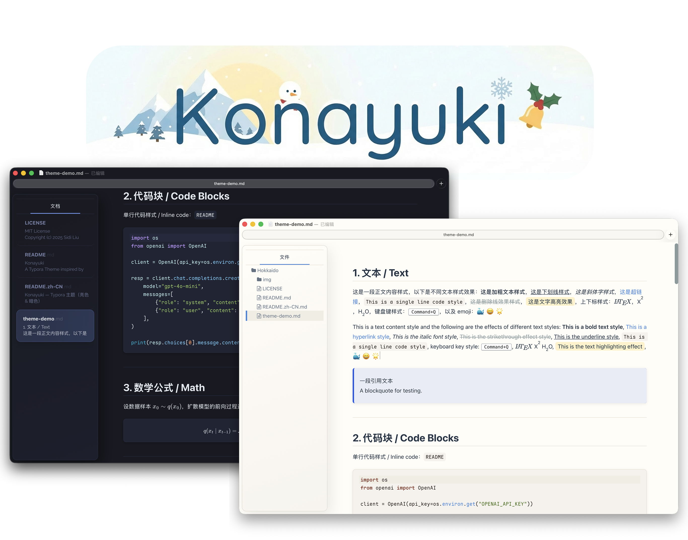
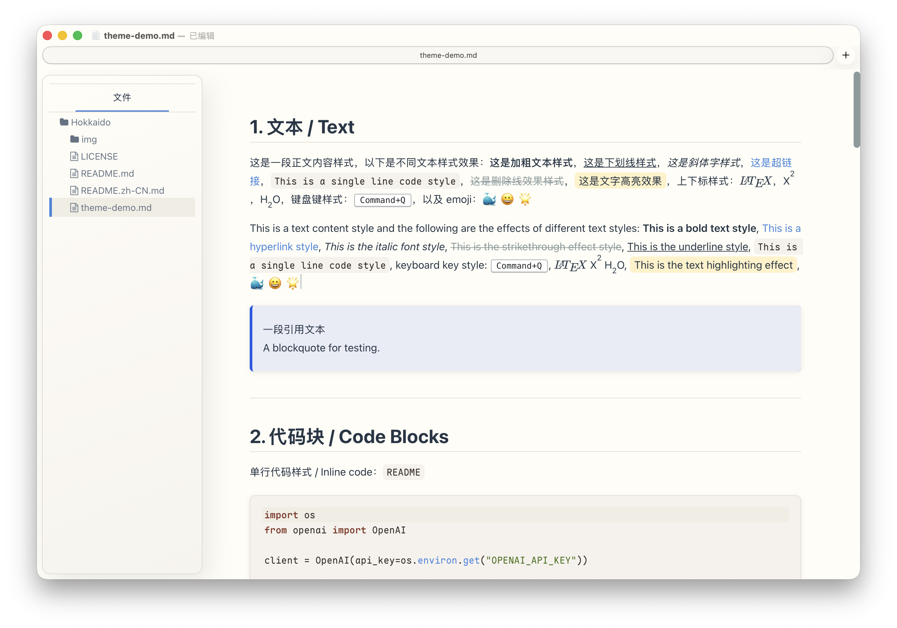
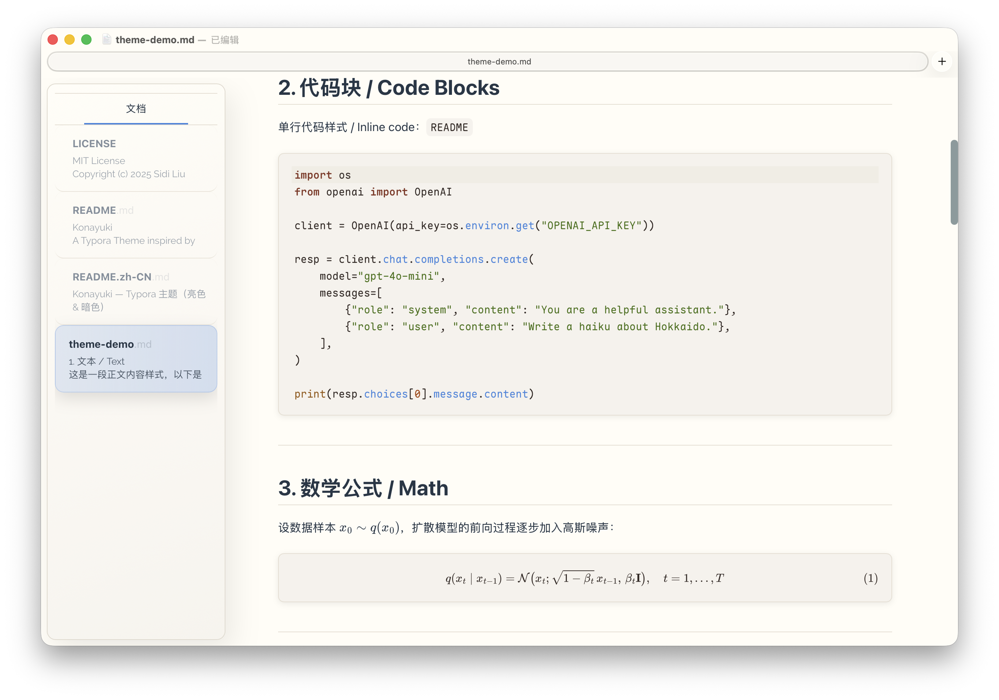
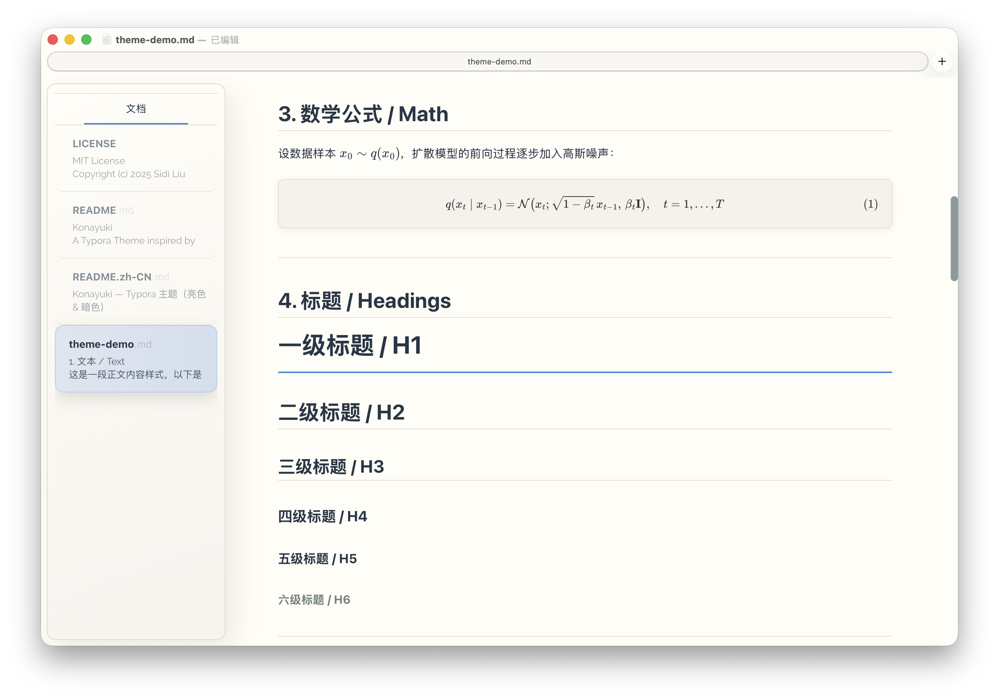
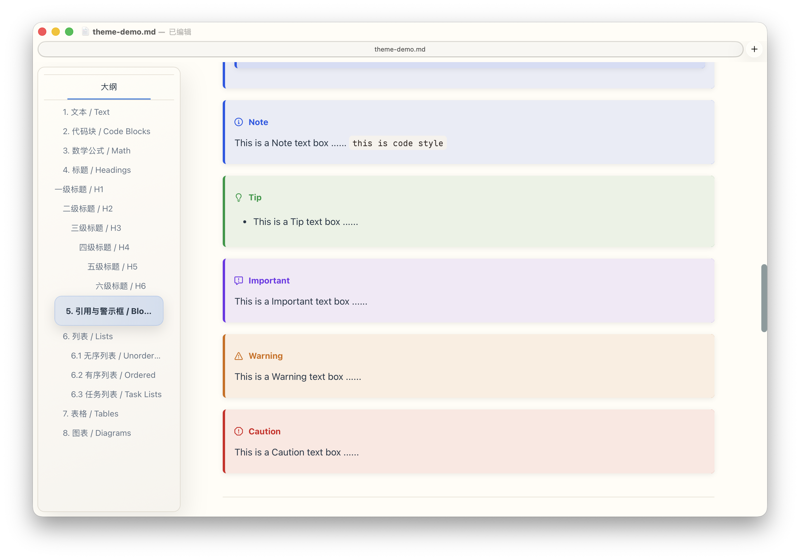
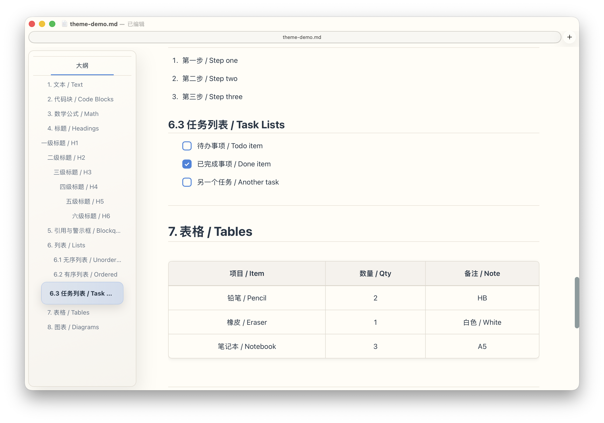
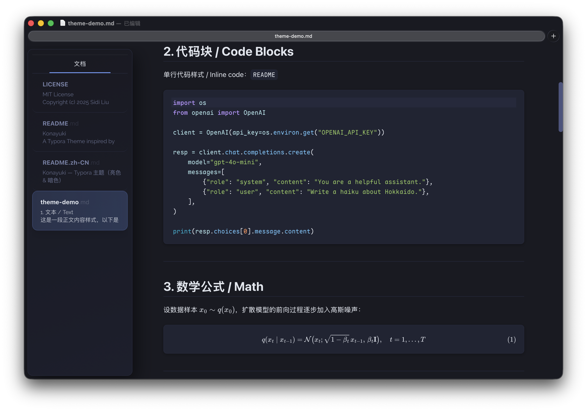
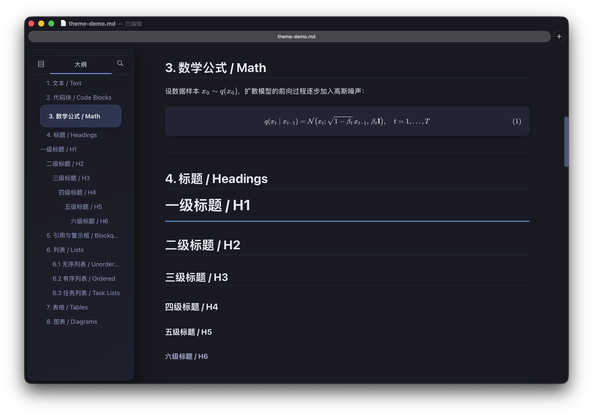
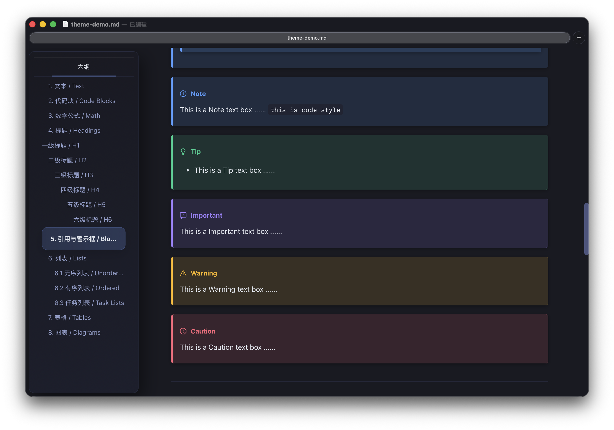
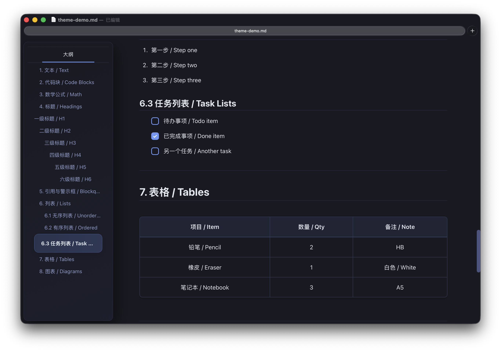

  

  
  
  
  

# Konayuki

A Typora Theme inspired by Konayuki's clean and beautiful scenery.

[中文说明](./README.zh-CN.md)

Konayuki is a Typora theme with a clean, modern look and carefully tuned colors for readability.

The theme is tested on MacOS

## Preview

### Light

  
   
  
   
  
   
  
   
  

### Dark

  
   
  
   
  
   
  
   
  

## Usage

1. In Typora: `Preferences` → `Appearance` → `Open Theme Folder`
2. Copy `konayuki-light.css` and `konayuki-dark.css` into the theme folder
3. Quit Typora and reopen
4. Select the theme from `Themes` menu:
   - `Konayuki Light`
   - `Konayuki Dark`

## Customize

- Fonts: edit `--font-ui` / `--font-mono` near the top of `konayuki-light.css` and `konayuki-dark.css`
- Platform note: `--font-ui` uses a system font stack, so the actual UI font may vary by OS (especially on Windows).
- Code font: the default monospace font is based on [Maple Font](https://github.com/subframe7536/maple-font) (`Maple Mono NF CN`). Install it for the best experience, or Typora will fall back to the next fonts in `--font-mono`.

## Credit

- [Mdmdt Theme](https://theme.typora.io/theme/Mdmdt/): Reference for Callouts styles
- [Tokyo City Theme](https://github.com/huytd/vscode-tokyo-city): Inspiration for dark mode color palette

---
